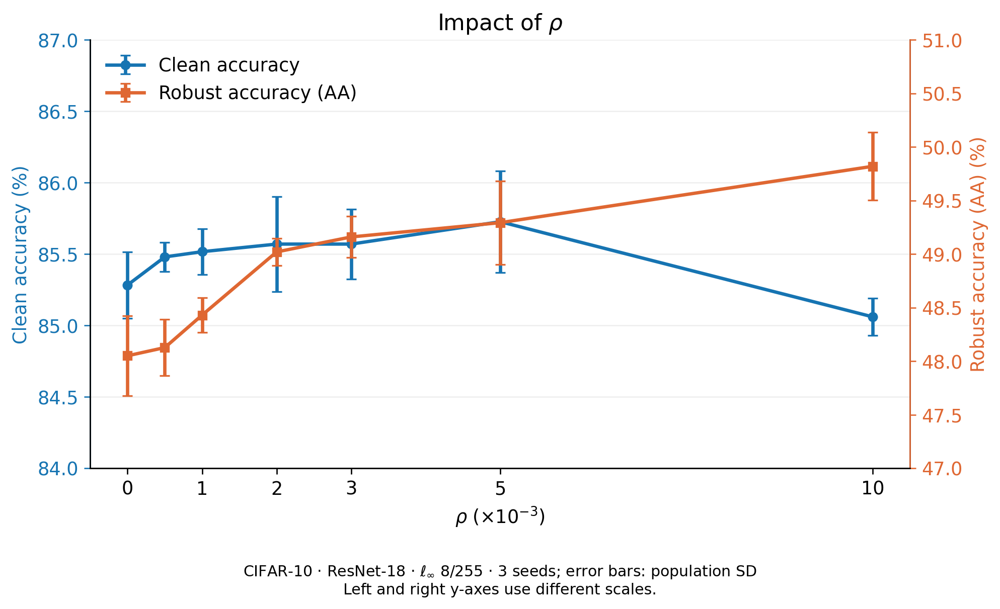
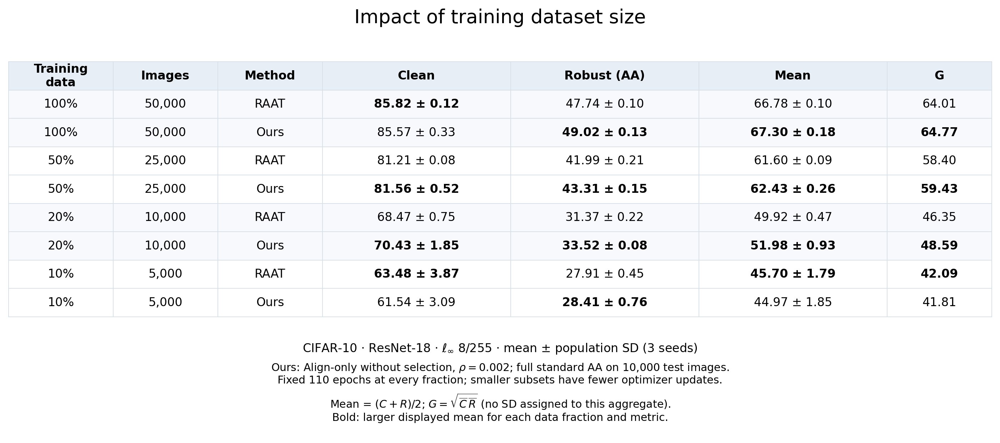

# Alignment-driven adversarial weight perturbation

Code for Align-only **without data selection** on CIFAR-10, CIFAR-100, and Tiny-ImageNet
with ResNet-18 and WideResNet-28-10 under L∞ and L2 attacks.

This release contains 12 setting-specific without-selection configurations:
2 architectures × 3 datasets × 2 attack norms, each run with seeds 0, 1, and 2.
Each run trains a model, selects its checkpoint by PGD accuracy, and then runs
clean evaluation plus **full standard AutoAttack on all 10,000 test examples**.

Start with the [reviewer reproduction guide](docs/REPRODUCIBILITY.md) for
download-and-extract instructions, checks that need no GPU or third-party
packages, and an explicit list of what this snapshot can reproduce.

## Report and completed studies

**Ours means Align-only without data selection.** Alignment constructs the
adversarial weight perturbation; classification and alignment both remain in
the training objective. The training configurations in this repository are for
this without-selection method.

- [Technical report and experiment interpretation](docs/REPORT.md)
- [CIFAR-10 / ResNet-18 study protocol and reproduction instructions](studies/README.md)
- [42 recorded per-seed results](results/cifar10_resnet18/per_seed.csv)
- [Dataset-size comparison with RAAT](results/cifar10_resnet18/impact_of_dataset_size.md)
- [Separate 10% follow-up: rho 0.001 versus 0.002](results/cifar10_resnet18_10pct_followup/comparison.md)
- [Main comparison: all 36 Ours seeds and 108 ResNet-18 baseline seeds](results/main_without_selection/README.md)
- [Completed ResNet-18 / Tiny-ImageNet follow-up](results/r18_tinyimagenet_linf_followup/README.md)





Regenerate both figures, the comparison table, and numerical summaries from
the included measurements (no training or GPU required):

```bash
python -m pip install -r studies/requirements.txt
python studies/reproduce_figures.py
```

There are seven rho points and eight method/fraction rows, all with three seeds.
The shared 100% reference results are reused, giving 42 unique seed records.
The separate RAAT comparison uses its original sample selection and no AWP;
it is a baseline, not a with-selection version of Ours.

Use `studies/run_study.py` to train the recorded data fractions or the full-data
rho sweep. It provides Ours and a separately labeled `raat_recorded` baseline
option; [study instructions](studies/README.md) describe the matched subsets,
fixed protocol, resume checks, and full-AA evaluation.

## Install

Use a separate Python 3.11 or 3.12 environment. Install matching PyTorch and
torchvision builds for your CUDA driver. The CPU smoke checks for this release
use PyTorch 2.5.1 and torchvision 0.20.1; this is not a recovered lockfile of the
historical cluster environment.

```bash
python -m venv .venv
source .venv/bin/activate
python -m pip install --upgrade pip
# Example for a CUDA 12.1 compatible system:
python -m pip install torch==2.5.1 torchvision==0.20.1 --index-url https://download.pytorch.org/whl/cu121
python -m pip install -r requirements.txt
```

See [PyTorch's version-specific installation commands](https://pytorch.org/get-started/previous-versions/)
for other CUDA versions or a CPU-only environment. Full experiments need a GPU;
select one visible GPU with `CUDA_VISIBLE_DEVICES=0` when several are installed.

## Data

Pass your dataset directory with `--data-root`. CIFAR-10/100 download through
torchvision on first use. For Tiny-ImageNet, extract the original
`tiny-imagenet-200` directory inside that root. The validation loader accepts
both the original `val/images` + `val_annotations.txt` layout and a validation
tree already grouped by class. It reads the data without moving images.

The input range is [0, 1]. The experiment pipeline uses random crop with padding
4 and horizontal flip for training, with two independently augmented views;
evaluation uses only conversion to a tensor.

## Run

First print the exact commands and flags without starting training:

```bash
python run_experiment.py --config configs/without_selection/r18_Linf_cifar10.json --seeds 0 --dry-run
```

Run one configuration with seeds 0, 1, and 2:

```bash
CUDA_VISIBLE_DEVICES=0 python run_experiment.py \
  --config configs/without_selection/r18_Linf_cifar10.json \
  --seeds 0 1 2 --data-root ./data --output-root ./runs
```

Seeds execute sequentially. For independent GPU allocations, run separate
commands with different `--seeds` values. Choose another dataset, architecture,
or norm from `configs/without_selection/`, for example:

```bash
CUDA_VISIBLE_DEVICES=0 python run_experiment.py \
  --config configs/without_selection/wrn_L2_cifar100.json \
  --seeds 0 1 2 --data-root ./data --output-root ./runs
```

Training completion automatically launches standard AutoAttack
(`apgd-ce`, `apgd-t`, `fab-t`, `square`). Evaluation has no test-subset option.
Each seed writes checkpoints, logs, configuration metadata, and `result.json`
under `runs/<experiment_id>/seed<N>/`.

Continue an interrupted run by repeating its command with `--resume`.
The configuration must match the existing directory. The driver retains the
best checkpoint in that directory, restores the global learning-rate schedule,
and continues from the next epoch. Completed evaluations are skipped.
For this release, exact bitwise equivalence across an interruption is not claimed.

## Configurations and method semantics

[configs/index.tsv](configs/index.tsv) lists all 12 settings and their seven
hyperparameters. The JSON files specify the same values. These without-selection
configurations preserve the recorded per-setting hyperparameters. All 12 now have
recorded evaluations for seeds 0, 1, and 2. The three Tiny-ImageNet entries
previously labeled seed-0-only have been updated from the completion records.
The WRN L∞ Tiny-ImageNet setting now selects `e15wt03` after its missing seeds
completed; [the follow-up](results/wrn_tinyimagenet_linf_followup/README.md)
includes all three raw records and preserves the previous configuration.
The ResNet-18 L∞ Tiny-ImageNet setting now selects `g19rt03`, which improves
Mean and G over `e15rt05` but still misses the fixed G target. Its previous
configuration and all six comparison records are retained in the
[follow-up](results/r18_tinyimagenet_linf_followup/README.md).
These evidence labels describe the native experiments, not a new reproduction
with this packaged environment. Completion does not imply that every setting
outperforms all baselines. See [the evidence update](docs/EVIDENCE.md).

| Parameter | Role |
|---|---|
| `gamma` | Weight-perturbation magnitude, scaled by each parameter tensor's norm |
| `awp_start` | First epoch using adversarial weight perturbation |
| `lam` | Alignment-loss coefficient |
| `bd_range` | Fraction of the input perturbation used for boundary treatment |
| `bd_alpha` | Symmetric Beta-distribution shape used to sample the mixing coefficient |
| `lr` | Initial SGD learning rate |
| `weight_decay` | SGD weight decay |

The published configurations use 110 epochs, batch size 128, PGD-10 training,
momentum 0.9, and learning-rate drops by 0.1 after epochs 100 and 105.
L∞ uses epsilon 8/255 and step size 2/255; L2 uses epsilon 128/255 and
step size 32/255. Alignment temperature is 0.5.

**Align-only names the objective used to construct the weight perturbation.**
The optimizer still trains with both classification and alignment losses.
Alignment includes every sample, without a correctness-based selection mask.
For Ours, the driver fixes `ALIGN_ALL_SAMPLES=1` and `RAAT_DATA_SELECTION=1` and only
accepts `selection: "no"`. Here the selection label refers to alignment-sample
selection; `RAAT_DATA_SELECTION=1` preserves the inherited classification-term
boundary treatment. Boundary treatment in the classification term
remains active.

The inherited input-attack path attacks the first augmented view and transfers
its detached perturbation to the second view with clipping. That computational
path is retained. Older exploratory branches remain in the inherited trainer;
the configuration driver explicitly disables them, preventing inherited shell
variables from changing an experiment.

The actual architectures are ResNet-18 with `BasicBlock` and WRN-28-10. Historical
names `pre_resnet18` and `wrn3410` remain accepted aliases for checkpoint/source
compatibility. Tiny-ImageNet uses first-convolution stride 2 in both models.

## Summarize

```bash
python summarize.py ./runs
```

Recompute the recovered main-comparison measurements without training:

```bash
python studies/reproduce_main_results.py --output-dir ./runs/recomputed-main
```

All 36 Ours seed records are included. ResNet-18 baseline records cover 108/108;
The comparison displays all 84 method/setting rows, using explicitly labeled
archived aggregates for the 36 WRN baseline rows whose per-seed records have
not been recovered. [Coverage and evidence levels](results/main_without_selection/README.md)
distinguish recovered tables, result metadata, and verified native training logs.

For clean accuracy C and AutoAttack accuracy R (both in percent):

- Mean = (C + R) / 2
- Geometric mean = sqrt(CR)

Clean, AA, and Mean are reported as mean ± population standard deviation
(`ddof=0`). The two geometric summaries have explicit names:

- `G_of_mean_accuracies` = sqrt(mean(C) × mean(R)), the definition used in the
  main results table. This aggregate is one value, with no invented SD.
- `per_seed_G_mean_std` = mean ± population SD of sqrt(C_seed × R_seed).

These are different nonlinear aggregations. Missing seeds remain labeled
`partial` in both summaries; partial results are not three-seed confirmations.

## Source and validation

Model definitions and loss/training kernels are retained from the provided
experiment snapshots. Packaging changes are described in
[docs/CHANGES.md](docs/CHANGES.md), with source checksums in
[docs/source_manifest.json](docs/source_manifest.json).
The entry points, data paths, and result collection are portable; cluster
accounts, personal paths, job IDs, and backup scripts are not part of this
repository. The selected study results included here have those identifiers removed.

```bash
python -m unittest discover -s tests -v
```

These are configuration, CPU numerical, and small synthetic-data workflow
checks. They do not repeat the 110-epoch GPU experiments or reproduce their
reported accuracies. Datasets, trained weights, and full experiment logs are
not bundled.

The earlier [complete-dependency and GPU workflow checks](docs/validation_reproduction_20260923.json)
passed all 20 tests then present and verified the native subset and baseline paths.
The [main-result update checks](docs/validation_main_20260925.json) passed 16 tests
locally, including three new result-integrity checks; seven PyTorch-dependent
tests were skipped in that environment. Training kernels are unchanged.
The later [comparison-display checks](docs/validation_main_20260927.json) passed
six relevant tests and verified all 84 displayed rows. They added no training
or AutoAttack evaluations.
The earlier local integration checks, including dependency limitations, are in
[docs/validation_local_20260922.json](docs/validation_local_20260922.json).
[docs/validation_report_update.json](docs/validation_report_update.json) records
the supplied package's checks; [docs/validation.json](docs/validation.json)
records the earlier CPU validation.

See [THIRD_PARTY_NOTICES.md](THIRD_PARTY_NOTICES.md) for source attribution and
the license status of the supplied snapshot.
